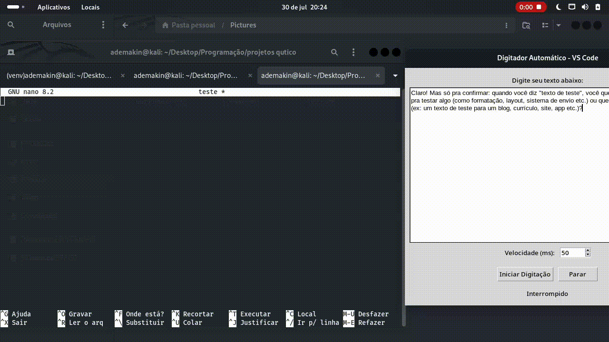

Claro, Natanael! Aqui está o **README completo, pronto para você colar no arquivo `README.md`** do seu repositório GitHub, com tudo integrado, incluindo a parte da demonstração com GIF:

````markdown
# 🖥️ Digitador Automático - VS Code (Python + Tkinter + pynput)

Este é um projeto em Python que simula a digitação automática de um texto em qualquer editor (como o VS Code).  
A aplicação possui uma interface gráfica feita com `Tkinter` e usa a biblioteca `pynput` para controlar o teclado.

---

## 📸 Demonstração

<p align="center">
  
</p>

---

## ✅ Requisitos

- Python 3.7 ou superior  
- Sistema com interface gráfica (Linux, Windows ou macOS)  
- Pip (gerenciador de pacotes do Python)  

---

## 📦 Instalação dos Pacotes e Execução

### 1. Clone o repositório:
```bash
git clone https://github.com/ademakin3051/digitador-automatico.git
cd digitador-automatico
````

---

### 2. (Opcional, mas recomendado) Crie e ative um ambiente virtual:

```bash
python3 -m venv venv
source venv/bin/activate  # Linux/macOS
# venv\Scripts\activate   # Windows
```

---

### 3. Instale as dependências:

```bash
pip install -r requirements.txt
```

> Caso não tenha o `pip` instalado, use:
>
> ```bash
> sudo apt install python3-pip
> ```

---

### 4. Dê permissão de execução ao script (opcional):

```bash
chmod +x escrever.py
```

> **Nota:** Dar permissão de execução (`chmod +x`) não é obrigatório para rodar o script com Python, mas é útil caso queira executar diretamente usando `./escrever.py` (se o script tiver o *shebang* correto).

---

### 5. Execute o programa:

```bash
python3 escrever.py
```

---

## 📝 Como Usar

1. Digite ou cole o texto desejado na interface.
2. Defina a velocidade da digitação (em milissegundos por caractere).
3. Clique em **"Iniciar Digitação"**.
4. Você terá 5 segundos para posicionar o cursor no local desejado (por exemplo, no VS Code).
5. O sistema digitará o texto automaticamente.

> ✅ Para interromper a digitação, clique em **"Parar"**.

---

## 📄 Arquivos do Projeto

```
📁 digitador-automatico
├── escrever.py             # Script principal com interface Tkinter
├── requirements.txt        # Lista de dependências
└── README.md               # Documentação do projeto
└── demo.gif                # Gif demo da ferramenta
```

---

## 🛑 Aviso

Este projeto é para fins **educacionais**.
Não utilize para automatizar processos que violem termos de uso de plataformas ou sistemas.

---

## 👨‍💻 Autor

Natanael de Lima Evangelista
🔗 [LinkedIn](https://www.linkedin.com/in/natanaellima10/)
🐙 [GitHub](https://github.com/ademakin3051)

```
